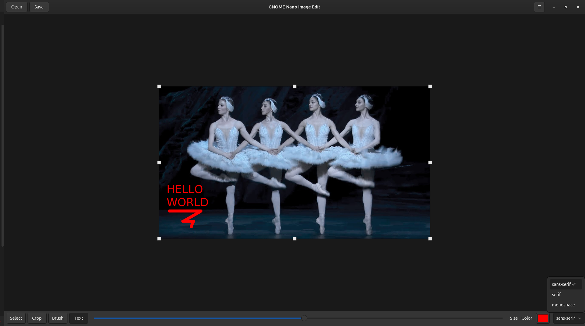

# GNIE: GNOME Nano Image Edit

# Overview

GNOME Nano Image Edit (GNIE) is a lightweight, ergonomic image editing utility designed specifically for quick, essential tasks on the GNOME environment. Unlike complex editors like GIMP, GNIE focuses on simple, common operations. It is the ideal tool for

- fast screen-shot edits
- simple cropping
- quick annotations without the distraction of layers or advanced filters.



# Key Features

Copy & Paste Section (Ctrl + C, Ctrl + V): Select a rectangular area and copy its contents to be pasted elsewhere in the image. You can also paste an image from system's buffer and copy it into buffer.

Crop Tool: Define a selection rectangle to trim the image to the desired area.

Text Overlay (Ctrl + T): Add simple, single-color text annotations anywhere on the image.

Brush Overlay (Ctrl + B): Add brush annotation with selected size and color.

Select and Move: Select an arbitrary section of the image and move it to a new location, leaving a transparent "hole" (or background color) where it originated.

# Technology Stack

Programming Language: Python 3

GUI Framework: PyGObject (GTK4)

Image Processing: pycairo

# Installation

1. `python -m pip install --upgrade build`
2. `python -m build`
3. `python -m pip install --force-reinstall dist/gnome_nano_image_edit-*.whl`

After installation, launch with:

```
python -m src.main
```

For development see: [development guide](./docs/development.md)


# Usage

TODO
