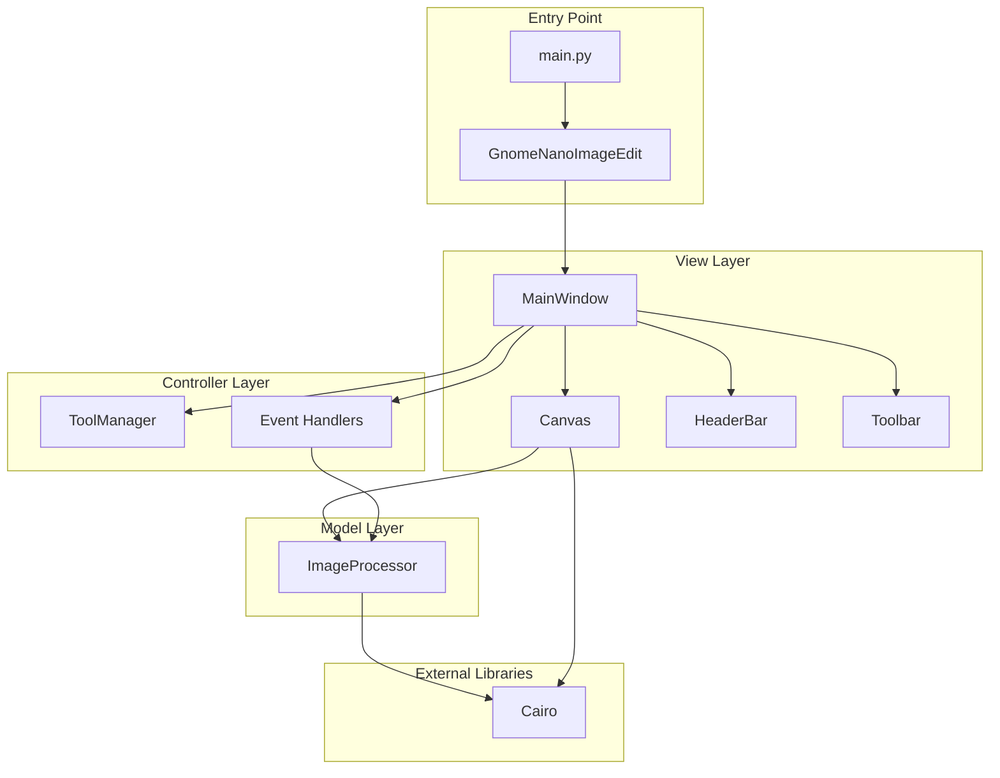
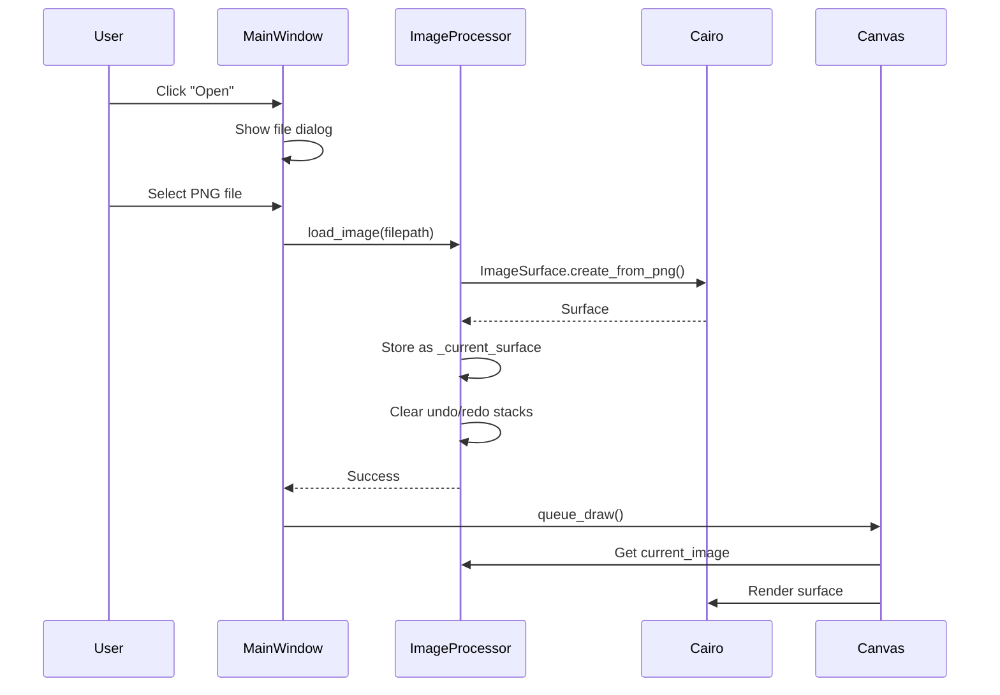
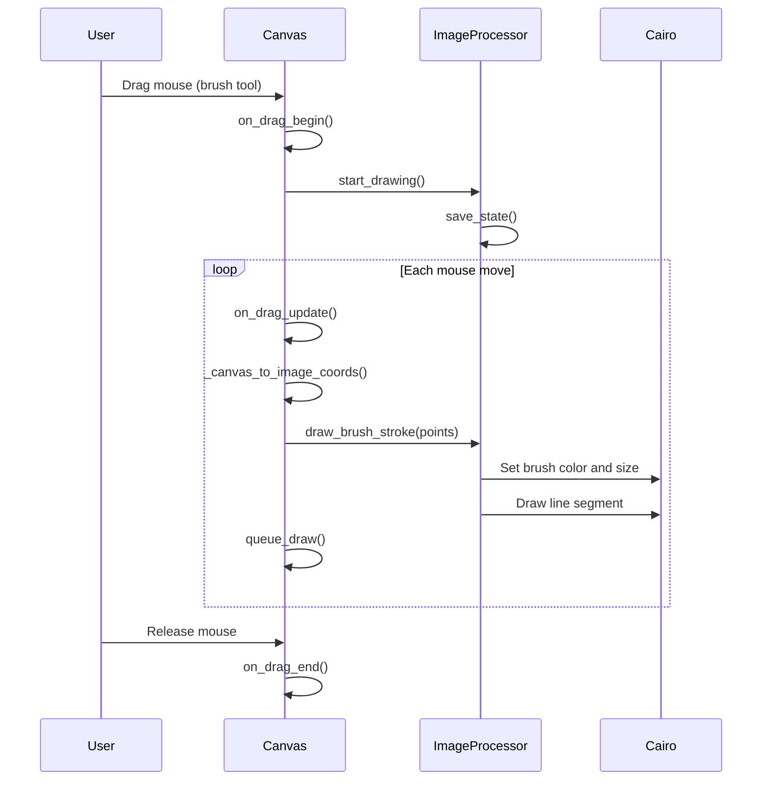
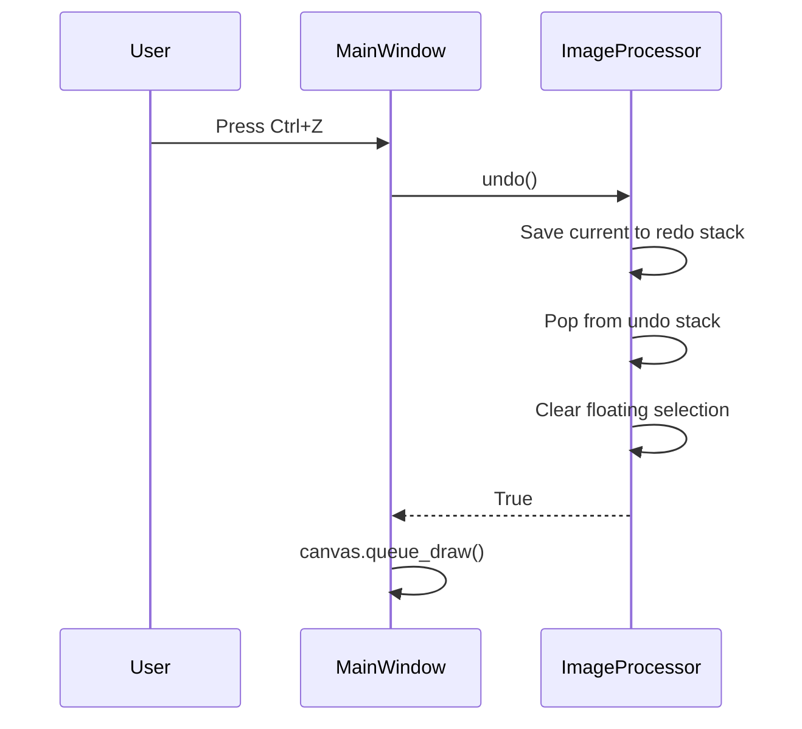

# GNOME Nano Image Edit - Architecture Documentation

## Overview

GNOME Nano Image Edit (GNIE) is a lightweight image editing application built with Python and GTK4. The application follows a Model-View-Controller (MVC) architectural pattern, providing essential image editing features like cropping, selecting, brush drawing, and text overlay.

## Architecture Pattern

The application implements a loosely-coupled MVC pattern:

- **Model**: [processor.py](/src/processor.py) - Manages image data and editing operations
- **View**: [canvas.py](/src/canvas.py) and [main_window.py](/src/main_window.py) - Handle UI rendering and display
- **Controller**: [manager.py](/src/manager.py) and event handlers in [main_window.py](/src/main_window.py) - Handle user interactions and business logic

---

## Component Architecture



---

## Core Components

### 1. Main Application ([main.py](/src/main.py))

The main application have responsibilities:

- Application lifecycle management
- GTK application initialization
- Main window creation


### 2. Main Window ([main_window.py](/src/main_window.py))

Responsibilities:
- UI layout and organization
- Toolbar and tool selection
- File operations (open/save)
- Keyboard shortcut handling
- Clipboard operations (copy/cut/paste)

Key Features:
- Tool selector with toggle buttons (Select, Crop, Brush, Text)
- Dynamic tool controls (brush size/color, font selection)
- Keyboard shortcuts (Ctrl+Z/Y for undo/redo, Ctrl+C/X/V for clipboard)
- Error dialog handling


### 3. Canvas Widget ([canvas.py](/src/canvas.py))

Responsibilities:
- Image rendering using Cairo
- User input event handling (mouse, keyboard, touch)
- Selection overlay rendering
- Canvas resize handle management
- Text entry overlay for text tool
- Zoom functionality (Ctrl+Scroll)

Key Features:
- Coordinate transformation between canvas and image space
- Drag-and-drop for selection creation and moving
- Zoom with Ctrl+Scroll (10% to 1000%)
- Canvas resize handles at edges and corners
- Text entry overlay with live preview

State Management:
- `selection_box`: Current selection rectangle in canvas coordinates
- `_drag_mode`: Current drag operation ('none', 'select', 'move', 'brush', 'text_create')
- `_zoom_level`: Current zoom factor (1.0 = 100%)
- `_image_display_rect`: Cached image geometry for coordinate mapping


### 4. Image Processor ([processor.py](/src/processor.py))

Responsibilities:
- Image data storage and manipulation using Cairo surfaces
- Editing operations (crop, cut, copy, paste)
- Brush and text drawing
- Undo/redo stack management
- Image loading and saving (PNG only)


Key Operations:
- `load_image(filepath)`: Load PNG image from file
- `save_image(filepath)`: Save current state as PNG
- `apply_crop(selection_box)`: Crop to selection
- `cut_selection(selection_box)`: Cut area to floating selection
- `copy_selection(selection_box)`: Copy area without removing
- `paste_selection()`: Paste floating selection to canvas
- `draw_brush_stroke(points)`: Draw brush stroke
- `add_text(text, x, y)`: Add text overlay
- `resize_canvas(width, height, anchor)`: Resize canvas with anchor point


### 5. Tool Manager ([manager.py](/src/manager.py))

Responsibilities:
- Track currently active tool
- Validate tool selection

Supported Tools:
- `select`: Select and move regions
- `crop`: Create crop selection
- `text`: Add text overlay
- `brush`: Freehand drawing
- `move`: (unused, handled by select tool)


## Data Flow

### Image Loading Flow



### Brush Tool Flow



### Undo/Redo Flow




## Technology Stack

| Component | Technology | Purpose |
|-----------|-----------|---------|
| Language | Python 3.8+ | Application logic |
| GUI Framework | PyGObject (GTK4) | Native Linux UI |
| Graphics | Cairo | Image rendering and manipulation |
| Event System | GTK Event Controllers | Mouse, keyboard, scroll events |


## Key Features Implementation

### Selection and Moving

1. User drags on canvas in Select tool mode
2. `Canvas` creates selection rectangle overlay
3. On drag end, `ImageProcessor.cut_selection()` extracts pixels
4. Area filled with transparent pixels
5. Cut data stored as `_floating_selection_data`
6. User can drag to reposition
7. Paste commits to canvas

### Crop Operation

1. User drags to create crop selection in Crop tool mode
2. User clicks "Apply Crop"
3. `ImageProcessor.apply_crop()` creates new surface with cropped dimensions
4. Original pixels copied to new surface at (0,0)
5. Old surface discarded

### Brush Drawing

1. User drags with Brush tool active
2. Each drag update collects point coordinates
3. Points converted from canvas to image space
4. Cairo draws line segments connecting points
5. Brush size and color applied from settings

### Text Overlay

1. User drags to create text box in Text tool mode
2. `Canvas` creates GTK TextView overlay
3. TextView positioned at drag rectangle
4. CSS styling applied for color/transparency
5. On Enter or focus loss, text rendered to image via Cairo
6. Overlay removed

### Canvas Resizing

1. Resize handles drawn at image edges/corners
2. Hit testing determines which handle is grabbed
3. Drag calculates new dimensions in image space
4. `ImageProcessor.resize_canvas()` creates new surface
5. Content positioned based on anchor point (opposite of grabbed handle)
6. Extra space filled with transparent pixels

## Performance Considerations

### Memory Management

- Undo stack limited to 20 entries
- Full surface copies for undo (simple but memory-intensive)
- Surface cloning creates deep copies for safety

### Rendering Optimization

- Geometry cached and recalculated only when needed
- `queue_draw()` called only when visual changes occur
- Cairo uses efficient surface blitting

### Coordinate Caching

- `_calculate_image_display_geometry()` caches results
- Single source of truth for widget↔image mapping
- Prevents redundant calculations


## Extension Points

### Adding New Tools

1. Add tool name to `ToolManager.VALID_TOOLS`
2. Add toggle button in `MainWindow.__init__()`
3. Add drag handling in `Canvas.on_drag_begin/update/end()`
4. Implement operation in `ImageProcessor`

### Supporting New File Formats

1. Use GdkPixbuf to load non-PNG formats
2. Convert GdkPixbuf to Cairo surface
3. Update save dialog filter and save method

### Advanced Features

Potential enhancements:
- Layers support (multiple Cairo surfaces)
- Filters and effects (Cairo operators)
- Color adjustment tools
- Shape drawing tools (rectangle, ellipse, line)
- Selection tools (lasso, magic wand)


## Limitations

| Limitation | Reason | Workaround |
|------------|--------|------------|
| PNG-only support | Cairo native format | Use external converter or integrate GdkPixbuf |
| Memory-intensive undo | Full surface copies | Implement diff-based undo |


## File Organization

```
gnome-nano-image-edit/
├── src/
│   ├── __main__.py          # Module entry point
│   ├── main.py              # Application class
│   ├── main_window.py       # Main window and UI
│   ├── canvas.py     # Drawing canvas
│   ├── processor.py   # Image operations
│   └── manager.py      # Tool state management
├── docs/                    # Documentation
├── assets/                  # Icons and resources
├── requirements.txt         # Python dependencies
├── README.md               # User documentation
└── SPECS.md                # Developer specifications
```

